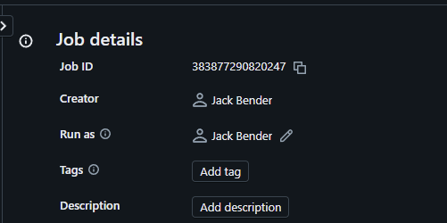
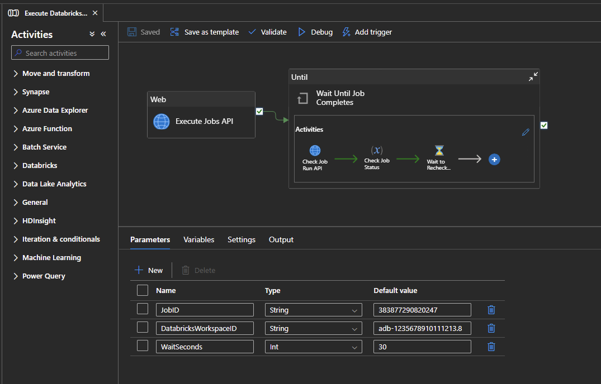
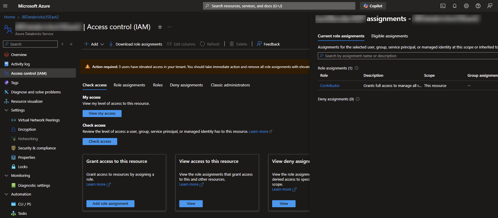
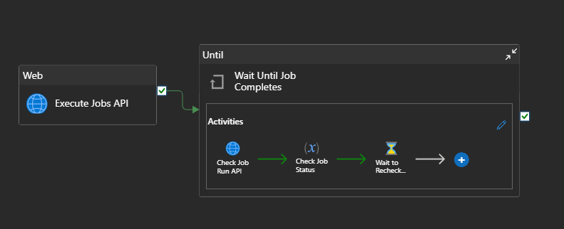

# Run an Azure Databricks DLT Pipeline

## Overview
These instructions are an adaption of the [Leverage Azure Databricks jobs orchestration from Azure Data Factory](https://techcommunity.microsoft.com/blog/analyticsonazure/leverage-azure-databricks-jobs-orchestration-from-azure-data-factory/3123862) article that was published in Feb 22 by [Clinton W Ford](https://www.linkedin.com/in/clintonwford/) and [Leo Furlong](https://www.linkedin.com/in/leoafurlongiv/) from Databricks. 

For DLT Pipelines I have modified their instructions to accommodate utilizing the following REST calls: 
- [Start a pipeline](https://docs.databricks.com/api/azure/workspace/pipelines/startupdate)
- [List pipeline updates](https://docs.databricks.com/api/azure/workspace/pipelines/listupdates)
- [Get a pipeline update](https://docs.databricks.com/api/azure/workspace/pipelines/getupdate)

The result of this is included in the [Execute Databricks Pipeline using MI](https://github.com/jcbendernh/ADFOrchestrator/blob/main/files/Execute%20Databricks%20Pipeline%20using%20MI.zip) Azure Data Factory Template within this repo. Thus, you do not need to build this pipeline from scratch, all the steps are already included in the template.  You only need to follow the steps below.

If you do not have a Databricks DLT Pipeline already created to run this against, you can use the following instructions to create one that can be utilized in the steps below: [Tutorial: Run your first DLT pipeline](https://learn.microsoft.com/en-us/azure/databricks/dlt/tutorial-pipelines)

## Instructions
To utilize the Azure Data Factory template, download it to your computer and install it within your Azure Data Factory instance using the following steps: 
1. Within your Azure Data Factory workspace, Click the <b>Home</b> button at the top of the left navigation bar.
2. On the home page click <b>Pipeline Templates</b> under the <b>Discover more</b> section at the bottom of the page.
3. In the Template gallery, click the <b>Import pipeline template</b> in the upper right and upload the zipped file.
4. Once it is installed in the gallery, select it and click <b>Continue</b>. The following screenshot shows what it will look like in the gallery &nbsp; 
 

5. On the <b>Execute Databricks Job using MI</b> screen, click the <b>Use this template</b> button in the bottom left.
6. This will bring you to the editor screen of the Pipeline.  You will need to modify 2 values on the <b>Parameters</b> tab of the overall pipeline to use it.
    1. <b>JobID:</b> The Databricks Job ID - This can be found on the Job Details tab of your Job.  
        1. Open your Job under Workflows of the Left Navigation Bar and click your job on the Jobs tab.
        2. Once the Job is open, copy the Job ID in the upper right corner under the Job detail tab. 
         &nbsp; 
    2. <b>DatabricksWorkspaceID:</b> This is in the Databricks URL. For example, you want to take the bolded portion of the following URL  
    https://<b>adb-1235678910111213.8.</b>azuredatabricks.net/ &nbsp; 
    When finished, your parameters should look like the screenshot below. 

7. Finally, you will need to add your <b>Azure Data Factory Managed Identity</b> to your Databricks workspace and give it the proper permissions to execute a Job.  To do so, grant the <b>Contributor</b> RBAC role to the Managed Identity in the Azure Databricks <b>Access Control (IAM)</b> blade of the Azure Portal. &nbsp;  

## Overview of the steps
Below are the overview of the steps utilized in this template. &nbsp; 

1. <b>Web Activity - Execute Jobs API</b>: Utilizes the [Trigger a new job run](https://docs.databricks.com/api/azure/workspace/jobs/runnow) Databricks REST API to trigger the specific Workflow/Job within your Databricks workspace. 
NOTE: This utilizes the universal Managed Identity of the Databricks service to make the REST call.
2. <b>Until Activity - Wait Until Job Completes</b>: Creates a loop of checking the state of the job until it is not equal to "RUNNING".
    1. <b>Web Activity - Check Job Run API</b>: This utilizes the [Get a single job run](https://docs.databricks.com/api/azure/workspace/jobs/getrun) Databricks REST API to retrieve the Job State of the specific Workflow/Job. 
    NOTE: This utilizes the universal Managed Identity of the Databricks service to make the REST call.
    2. <b>Variable Activity - Check Job Status</b>: Applies an iif statement to identify the job as either "RUNNING" or not "RUNNING".
    3. <b>Wait Activity - Wait to Recheck API</b>: Waits "x" seconds based on the  pipeline parameter of <b>WaitSeconds</b>. 