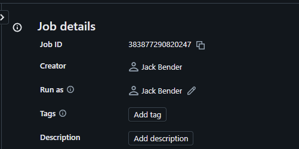
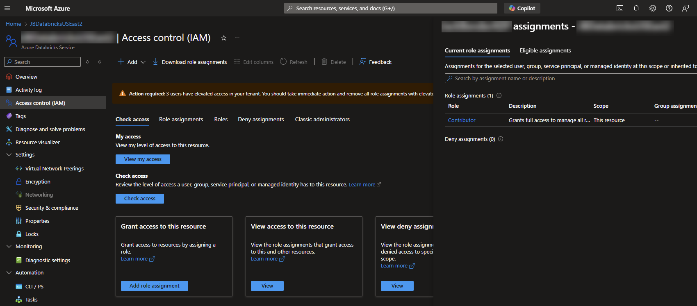

# Run an Azure Databricks Job

These instructions are based on the [Leverage Azure Databricks jobs orchestration from Azure Data Factory](https://techcommunity.microsoft.com/blog/analyticsonazure/leverage-azure-databricks-jobs-orchestration-from-azure-data-factory/3123862) article that was published in Feb 22 by [Clinton W Ford](https://www.linkedin.com/in/clintonwford/) and [Leo Furlong](https://www.linkedin.com/in/leoafurlongiv/) from Databricks. 

I went through their instructions and made a few minor changes.  These are included in the [Execute Databricks Job using MI](https://github.com/jcbendernh/ADFOrchestrator/blob/main/files/Execute%20Databricks%20Job%20using%20MI.zip) Azure Data Factory Template within this repo.

If you do not have a Databricks Job already created, you can use the following instructions to create one that can be utilized in the steps below: [Create your first workflow with an Azure Databricks job](https://learn.microsoft.com/en-us/azure/databricks/jobs/jobs-quickstart)

To utilize it, download it to your computer and install it to your Azure Data Factory instance using the following instructions: 
1. Within your Azure Data Factory workspace, Click the <b>Home</b> button at the top of the left navigation bar.
2. On the home page click <b>Pipeline Templates</b> under the <b>Discover more</b> section at the bottom of the page.
3. In the Template gallery, click on the <b>Import pipeline template</b> in the upper right.
4. Once it is installed in the gallery, select it and click <b>Continue</b>. 
 

5. On the <b>Execute Databricks Job using MI</b> screen, click the <b>Use this template</b> button in the bottom left.
6. This will bring you to the editor screen of the Pipeline.  You will need to modify 2 values on the <b>Parameters</b> tab of the overall pipeline to use it. 
&nbsp;&nbsp;&nbsp;&nbsp;a. <b>JobID:</b> This can be found on the Job Details tab of your Job.  
&nbsp;&nbsp;&nbsp;&nbsp;&nbsp;&nbsp;&nbsp;&nbsp;i.  Open your Job under Workflows of the Left Navigation Bar and click your job on the Jobs tab. 
&nbsp;&nbsp;&nbsp;&nbsp;&nbsp;&nbsp;&nbsp;&nbsp;ii.  Once the Job is open, copy the Job ID in the upper right corner under the Job detail tab. 
&nbsp;&nbsp;&nbsp;&nbsp;&nbsp;&nbsp;&nbsp;&nbsp; &nbsp; 
&nbsp;&nbsp;&nbsp;&nbsp;b. <b>DatabricksWorkspaceID:</b> This is in the Databricks URL. For example, you want to take the bolded portion of this URL... https://<b>adb-1235678910111213.8.</b>azuredatabricks.net/

&nbsp;&nbsp;&nbsp;&nbsp;&nbsp;&nbsp;When finished, your parameters should look like the following... 
&nbsp;&nbsp;&nbsp;&nbsp;&nbsp;&nbsp;

7. Last of you will need to add your Azure Data Factory Managed Identity to your Databricks workspace and give it the proper permissions to execute a Job.  To do so, grant the <b>Contributor</b> RBAC role to the Managed Identity in the Azure Databricks <b>Access Control (IAM)</b> blade of the Azure Portal.  

