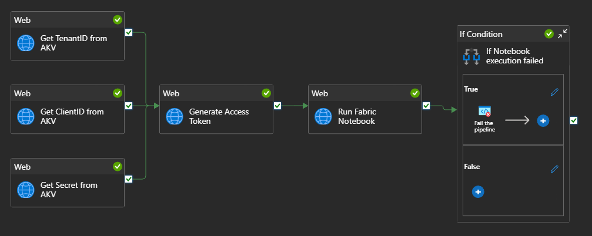
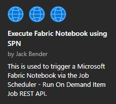
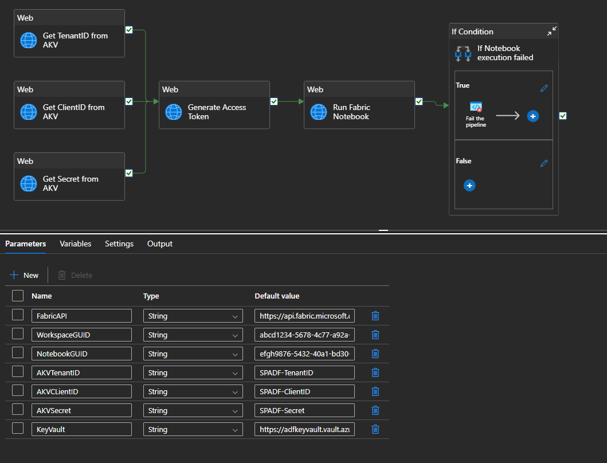

# Run a Microsoft Fabric Notebook
## Overview

These instructions allow you to execute a Fabric Notebook from Azure Data Factory.  The result of this is included in the [Execute Fabric Notebook using SPN](https://github.com/jcbendernh/ADFOrchestrator/blob/main/files/Execute%20Fabric%20Notebook%20using%20SPN.zip) Azure Data Factory Template within this repo. Thus, you do not need to build this pipeline from scratch, all the steps are already included in the template. You only need to follow the steps below.

Here is an overview of the Data Factory Pipeline &nbsp; 

The template utilizes the the following Fabric REST API call: [Job Scheduler - Run On Demand Item Job](https://learn.microsoft.com/en-us/rest/api/fabric/core/job-scheduler/run-on-demand-item-job?tabs=HTTP)

## Prerequisites
1. <b>Azure Service Principal</b> - We can use an Azure Service Principal (SPN) to make REST calls to the Fabric API. To do so, follow these steps.
    1. [Register an application with Microsoft Entra ID and create a service principal](https://learn.microsoft.com/en-us/entra/identity-platform/howto-create-service-principal-portal#register-an-application-with-microsoft-entra-id-and-create-a-service-principal) - Once finished, make sure to copy the following values from the Overview tab.
        1. Application (client) ID
        2. Directory (tenant) ID
    2. [Set up authentication - Option 3: Create a new client secret](https://learn.microsoft.com/en-us/entra/identity-platform/howto-create-service-principal-portal#option-3-create-a-new-client-secret) - When creating the client secret on the SPN, make sure to copy the secret value, <b>this is only displayed upton creation and cannot be copied again</b>.
2. <b>SPN roles in the target Fabric Workspace</b> - Add your newly created SPN to your workspace with at least the Contributor role.  For more information on Fabric Workspace Roles check out [Roles in workspaces in Microsoft Fabric](https://learn.microsoft.com/en-us/fabric/fundamentals/roles-workspaces).
3. <b>Azure Key Vault</b> - We need to create an Azure Key Vault and add 3 secrets to be utilized by the ADF Rest call to Fabric.  To do so, follow these steps.
    1. Create a Key Vault using the following article: [Quickstart: Create a key vault using the Azure portal](https://learn.microsoft.com/en-us/azure/key-vault/general/quick-create-portal)
    2. Add yourself as a <b>Key Vault Administrator</b> and <b>Key Vault Secrets Officer</b> to the RBAC permissions of the newly created Key Vault using the following article: [Provide access to Key Vault keys, certificates, and secrets with Azure role-based access control](https://learn.microsoft.com/en-us/azure/key-vault/general/rbac-guide?tabs=azure-portal)
    3. Add the following secrets to your Key Vault instance using the following article: [Quickstart: Set and retrieve a secret from Azure Key Vault using the Azure portal](https://learn.microsoft.com/en-us/azure/key-vault/secrets/quick-create-portal)
        1. SPADF-TenantID = Directory (tenant) ID from Step 1-i above
        2. SPADF-ClientID = Application (client) ID from Step 1-i above
        3. SPADF-Secret = Client secret value from Step 1-ii above
4. <b>Key Vault Linked Service in Azure Data Factory</b> - Create the Linked Service using the following article: [Store credentials in Azure Key Vault](https://learn.microsoft.com/en-us/azure/data-factory/store-credentials-in-key-vault) NOTE: For step 2 of the article, follow the <b>Access control</b> option. 
5. <b>Enable SPN authentication for Fabric API</b> - Enable SPN access to Fabric via the Admin Portal using the following article: [Enable service principal authentication for admin APIs](https://learn.microsoft.com/en-us/fabric/admin/enable-service-principal-admin-apis)
6. If you do not have an existing Fabric Notebook to run this against, you can use the following instructions to create one: [Ingest data with Spark and Microsoft Fabric notebooks](https://github.com/MicrosoftLearning/mslearn-fabric/blob/main/Instructions/Labs/10-ingest-notebooks.md).

## Instructions
To utilize the [Execute Fabric Notebook using SPN](https://github.com/jcbendernh/ADFOrchestrator/blob/main/files/Execute%20Fabric%20Notebook%20using%20SPN.zip) Azure Data Factory template, download it to your computer and install it within your Azure Data Factory instance using the following steps: 
1. Within your Azure Data Factory workspace, click the <b>Home</b> button at the top of the left navigation bar.
2. On the home page, click <b>Pipeline Templates</b> under the <b>Discover more</b> section at the bottom of the page.
3. In the Template gallery, click the <b>Import pipeline template</b> in the upper right and upload the zipped file.
4. Once it is installed in the gallery, select it and click <b>Continue</b>. The following screenshot shows what it will look like in the gallery &nbsp; 
 

5. On the <b>Execute Fabric Notebook using SPN</b> screen, click the <b>Use this template</b> button in the bottom left.
6. This will bring you to the editor screen of the Pipeline.  You will need to modify the following values on the <b>Parameters</b> tab of the overall pipeline to use it.
    1. <b>FabricAPI:</b> https://api.fabric.microsoft.com/v1
    2. <b>WorkspaceGUID:</b> This GUID listed in your workspace URL just after groups. For example, it would be the highlighted value in this URL 
    app.fabric.microsoft.com/groups/<mark>abcd1234-5678-4c77-a92a-b0ec8058a6de</mark>/list?experience=fabric-developer
    3. <b>NotebookGUID:</b> This GUID listed in your workspace URL just after synapsenotebooks. For example, it would be the highlighted value in this URL 
    app.fabric.microsoft.com/groups/abcd1234-5678-4c77-a92a-b0ec8058a6de/synapsenotebooks/<mark>efgh9876-5432-40a1-bd30-b1a937683c50</mark>?experience=fabric-developer
    4. <b>AKVTenantID:</b> SPADF-TenantID
    5. <b>AKVCLientID:</b> SPADF-ClientID
    6. <b>AKVSecret:</b> SPADF-Secret
    7. <b>KeyVault:</b> The <b>Vault URI</b> value on the Overview tab of your Azure Key Vault instance in the Azure Portal. 
    For example - https://adfkeyvault.vault.azure.net/

When finished, your parameters should look like the screenshot below. &nbsp; 

## Overview of the steps
Below are the overview of the steps utilized in this template. &nbsp; 

1. <b>Web Activity - Get TenantID from AKV</b>: Retrieves the SPADF-TenantID secret from Azure Key Vault. 
NOTE: This utilizes the Managed Identity of the Azure Data Factory service to make the REST call.
2. <b>Web Activity - Get ClientID from AKV</b>: Retrieves the SPADF-ClientID secret from Azure Key Vault. 
NOTE: This utilizes the Managed Identity of the Azure Data Factory service to make the REST call.
3. <b>Web Activity - Get Secret from AKV</b>: Retrieves the SPADF-Secret secret from Azure Key Vault. 
NOTE: This utilizes the Managed Identity of the Azure Data Factory service to make the REST call.
4. <b>Web Activity - Generate Access Token</b>: Retrieves an access token for the SPN via the Entra ID OAuth 2.0 token endpoint. 
NOTE: This utilizes the SPN created to make the REST call.
5. <b>Web Activity - Run Fabric Notebook</b>: Utilizes the [Job Scheduler - Run On Demand Item Job](https://learn.microsoft.com/en-us/rest/api/fabric/core/job-scheduler/run-on-demand-item-job?tabs=HTTP) Fabric REST API to trigger the specific Notebook within your Fabric workspace. 
NOTE: This utilizes the SPN access token created in step 4 to make the REST call.
6. <b>If Condition - If Notebook execution failed:</b> If the output status of the <b>Web Activity - Run Fabric Notebook</b> equals "Failed" it triggers the <b>Fail the Pipeline</b> activity.
    1. <b>Fail the pipeline:</b> Writes the following values:
        1. <b>Fail Message:</b> Run Fabric Notebook activity output failureReason.message
        2. <b>Error Code:</b> Run Fabric Notebook activity output failureReason.errorCode