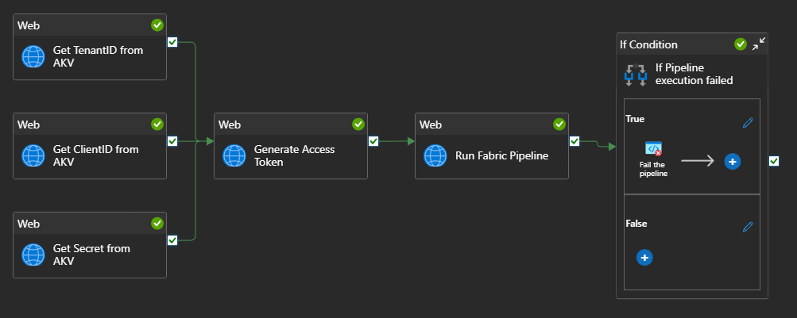

# Run a Microsoft Fabric Data Pipeline
## Overview

**Work in Progress**

These instructions allow you to execute a Fabric Data Pipeline from Azure Data Factory.  The result of this is included in the [Execute Fabric Pipeline using SPN](https://github.com/jcbendernh/ADFOrchestrator/blob/main/files/Execute%20Fabric%20Pipeline%20using%20SPN.zip) Azure Data Factory Template within this repo. Thus, you do not need to build this pipeline from scratch, all the steps are already included in the template. You only need to follow the steps below.

Here is an overview of the Data Factory Pipeline &nbsp; 

The template utilizes the the following Fabric REST API call: [Job Scheduler - Run On Demand Item Job](https://learn.microsoft.com/en-us/rest/api/fabric/core/job-scheduler/run-on-demand-item-job?tabs=HTTP)

## Prerequisites
1. <b>Azure Service Principal</b> - We can use an Azure Service Principal (SPN) to make REST calls to the Fabric API. To do so, follow these instructions.
    1. [Register an application with Microsoft Entra ID and create a service principal](https://learn.microsoft.com/en-us/entra/identity-platform/howto-create-service-principal-portal#register-an-application-with-microsoft-entra-id-and-create-a-service-principal) - Once finished make sure to copy the following values from the Overview tab.
        1. Application (client) ID
        2. Directory (tenant) ID
    2. [Set up authentication - Option 3: Create a new client secret](https://learn.microsoft.com/en-us/entra/identity-platform/howto-create-service-principal-portal#option-3-create-a-new-client-secret) - When creating the secret, make sure to copy the secret value, <b>this is only displayed upton creation and cannot be copied again</b>.
2. <b>SPN roles in the target Fabric Workspace</b> - Add your newly created SPN to your workspace with at least the Contributor role.  For more information on Fabric Workspace Roles check out [Roles in workspaces in Microsoft Fabric](https://learn.microsoft.com/en-us/fabric/fundamentals/roles-workspaces).
- Azure Key Vault
- Key Vault Linked Service in Azure Data Factory
- REST API Enabled in Fabric Portal
