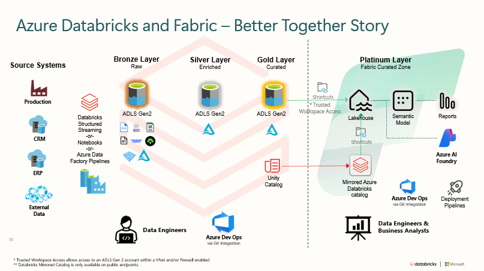

# Using Azure Dta Factory as an Orchestrator for Azure Databricks and Microsoft Fabric

Within Microsoft, I am a proponent of the better together story with Azure Databricks and Microsoft Fabric  The purpose of this Repo is to show how you can utilize Azure Data Factory to execute Job and DLT Pipelines in Databricks and Data Pipelines and Notebooks in Fabric.

Below is a Diagram of this approach.

Azure Data Factory is needed for a variety of reasons.
1) It can be used to orchestrate jobs in both Azure Databricks and Microsoft Fabric
2) It can connect to a variety of data sources.
3) It can utilize a Shared Integration Runtime

Below are links for the following scenarios.  I have also created Azure Data Factory Templates for your convenience.

- Run an Azure Databricks Job
- Run an Azure Databricks DLT Pipeline
- Run a Microsoft Fabric Data Pipeline
- Run a Microsoft Fabric Data Notebook

I hope you find these useful.
