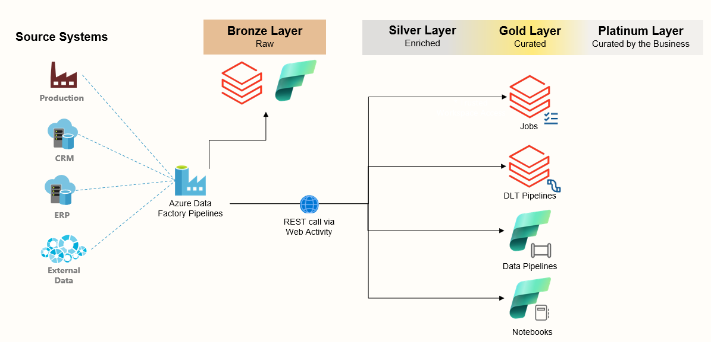

# Using Azure Data Factory as an Orchestrator for Azure Databricks and Microsoft Fabric

I have multiple customers that use a blended approach of both Azure Databricks and Microsoft Fabric. In most cases they are using Azure Data Factory as the primary ingestion engine from their source data to their Raw/Bronze environment.  

This is because it can handle private connections to both on-premise and Azure Virtual Network / Private Endpoints easier than Databricks and Fabric and has the ability to share its Self Hosted Integration Runtime across multiple environments.

This poses the question of "how do you orchestrate all of these technologies?"

Since both Azure Databricks and Microsoft fabric have the ability to trigger assets and workflows via their rest APIs, <b>we can use Azure Data Factory as that orchestration engine</b>.   

Below are links for the following scenarios with instructions on how to use the Azure Data Factory Templates that I have provided as well.

- [Run an Azure Databricks Job](DatabricksJob.md)
- [Run an Azure Databricks DLT Pipeline](DatabricksDLTPipeline.md)
- [Run a Microsoft Fabric Data Pipeline](FabricPipeline.md)
- [Run a Microsoft Fabric Data Notebook](FabricNotebook.md)

Below is a Diagram of this approach.  I hope you find this useful.

